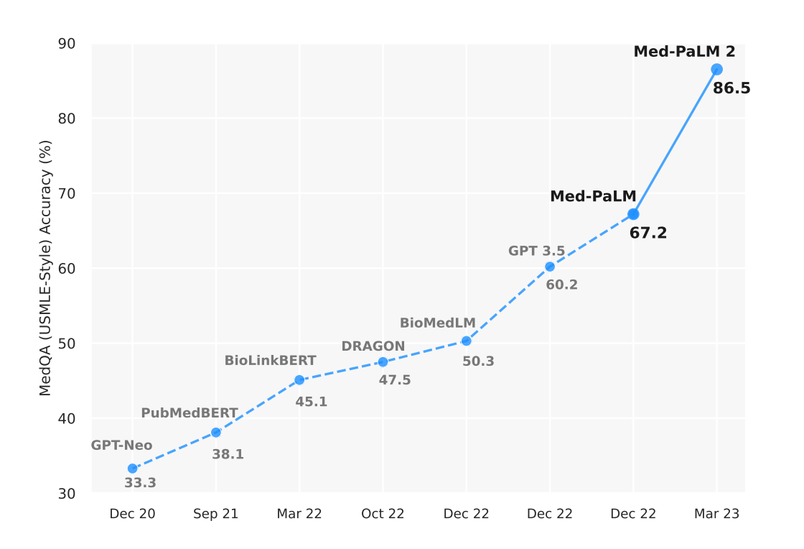

# The answer is the easy part

*Med-PaLM 2 made news by scoring 86.5% on the MedQA dataset setting a new state-of-the-art. A great new tool for practitioners, but the truly difficult parts remain.*

Not only did [Med-PaLM2](https://arxiv.org/abs/2305.09617) become [the leader on the MedQA-USMLE benchmark](https://paperswithcode.com/sota/question-answering-on-medqa-usmle), it was also reported that "physicians preferred Med-PaLM 2 answers to those produced by physicians on eight of nine axes pertaining to clinical utility."

Even in the middle of a typhoon of very impressive results, this appears to be an [AlexNet moment type jump](https://en.wikipedia.org/wiki/AlexNet) for this benchmark. _(Side note: exponential curves make for humorous time-based x-axes, note the gaps in months are_ 9, 6, 7, 2, 0, 0, 3_)_

However, the answer is the easy part. It's just a prediction made by a machine based on what it read on the internet.

What remains?

1.  Identifying what is missing or unknown.
2.  Formulating a clear, correct and complete question.
3.  Some typing, speaking or eventually neural-linking.
4.  Reading and understanding the meaning of an answer.
5.  Validating the correctness of an answer.
6.  Determining all possible options based on an answer.
7.  Evaluating all these options considering the full spectrum of human values.
8.  Communicating these options to other humans in a clear, emotionally appropriate manner.
9.  Collaborating with others to decide the best course of action.
10.  Some more typing, speaking or eventually neural-linking.

See, lots of good stuff for humans to do with their shiny new tools!

Asking good questions will continue to differentiate experts from non-experts and humans from AI. Because, to ask really good questions you need to know what is missing and you need to care that it is.

## The Human Elements That Remain Critical

### Clinical Intuition and Experience

While Med-PaLM 2 can process vast amounts of medical literature and provide accurate answers to well-formed questions, it lacks the clinical intuition that comes from years of patient interaction. A seasoned physician can pick up on subtle cues—a patient's demeanor, an unusual combination of symptoms, or an inconsistency in their story—that might lead to asking entirely different questions.

### Understanding Context and Stakes

Medical decisions aren't made in a vacuum. They involve understanding:

- Patient preferences and values
- Quality of life considerations  
- Economic constraints
- Family dynamics
- Cultural factors
- Risk tolerance

An AI can tell you the statistical best treatment option, but it can't weigh that against a patient's deeply held beliefs about end-of-life care or their financial situation.

### The Art of Medical Communication

Delivering medical information is as much art as science. The same prognosis might need to be communicated completely differently to:

- A 25-year-old software engineer who wants all the technical details
- An elderly patient who prefers simple, reassuring language
- A worried parent trying to understand their child's condition
- A family grappling with a terminal diagnosis

### Collaborative Decision Making

Modern medicine is increasingly collaborative, involving multiple specialists, patients, families, and care teams. Facilitating these conversations, managing conflicting opinions, and building consensus requires emotional intelligence and interpersonal skills that go far beyond pattern matching.

## The Questions Behind the Questions

Perhaps most importantly, the best clinicians are excellent at identifying what questions need to be asked. They can:

- Recognize when standard protocols don't apply
- Identify gaps in available information
- Question assumptions and dig deeper
- Consider what might be missing from the current picture

This meta-cognitive skill—knowing what you don't know and caring enough to find out—remains distinctly human.

## A Tool, Not a Replacement

Med-PaLM 2 and similar AI systems represent incredibly powerful tools that can augment human expertise. They can:

- Rapidly synthesize vast amounts of literature
- Provide comprehensive differential diagnoses
- Suggest evidence-based treatment options
- Flag potential drug interactions or contraindications

But they work best when wielded by skilled practitioners who know how to ask the right questions, interpret the answers in context, and navigate the complex human elements of medical care.

The future of medicine isn't AI replacing doctors—it's AI amplifying the uniquely human aspects of healing while handling the information processing tasks that machines do better than humans.

And that future looks pretty exciting to me.