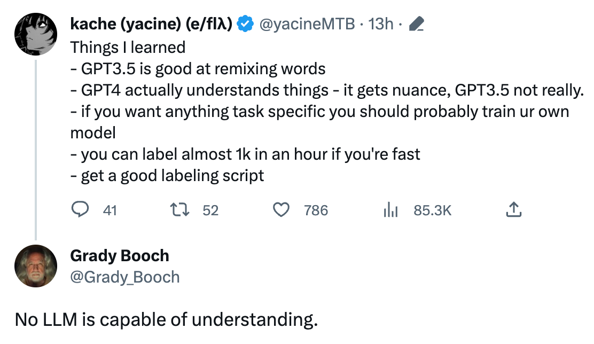

# LLMs Just Don't Understand

I agree with Grady's [tweet](https://twitter.com/Grady_Booch/status/1679767930748432385):

But I also understand (at least I think, I think I do), that it's difficult to describe the subtleties of LLMs and their capabilities at language manipulation and automation without resorting to anthropomorphism at times.

So, I decided to manipulate some tokens using my [word calculator](https://simonwillison.net/2023/Apr/2/calculator-for-words/) to come up with some alternative terms:

Here is the information organized into a Markdown table:

| Concept          | LLM Capability                                                                                                 | Alternate Terminology     |
|------------------|----------------------------------------------------------------------------------------------------------------|---------------------------|
| Hallucinations   | Produces outputs that don't align with established reality, creating novel or unusual responses.               | Novelty Creation          |
| Reasoning        | Provides outputs that follow a logical structure based on the context of the input.                            | Logic Simulation          |
| Understanding    | Generates contextually relevant outputs by processing the semantic structure of the input.                     | Contextual Response       |
| Learning         | Produces new responses by applying patterns acquired during training.                                          | Pattern Use               |
| Memory           | Uses information embedded in training data to generate responses that seem contextually appropriate.           | Data Recall               |
| Judgement        | Produces outputs that appear to evaluate or weigh different factors or options.                                | Evaluation Simulation     |
| Decision-making  | Selects the most fitting output from a range of possibilities based on the input.                              | Optimal Selection         |
| Reading          | Processes and understands the structure and semantics of written language.                                     | Text Interpretation       |
| Writing          | Produces written content that follows grammatical rules and matches the context of the input.                  | Text Production           |
| Imagination      | Generates narratives or scenarios that extend beyond the given input.                                          | Scenario Creation         |
| Thinking         | Generates outputs that seem to display a thought process, achieved by pattern matching based on training data. | Simulated Thought Process |
| Translation      | Converts a piece of text from one language to another, maintaining the meaning and context.                    | Language Conversion       |
| Listening        | In the context of voice recognition software, transcribes spoken language into written text.                   | Audio Transcription       |
| Speaking         | In the context of text-to-speech software, converts written text into spoken language.                         | Speech Synthesis          |

Would you like to add or modify any entries in this table?

I honestly don't like them because they are clunky and hard to remember.

But I now have a blog article to point to when I see smart people arguing over definitions.

## The Challenge of Describing AI

The fundamental challenge we face when discussing AI capabilities is that our language evolved to describe human cognition and behavior. When we apply these same terms to artificial systems, we inevitably import assumptions about consciousness, intentionality, and understanding that may not apply.

Consider the word "understanding." When we say a human understands something, we imply:

- Conscious awareness of the concept
- Ability to apply knowledge flexibly across contexts
- Emotional or experiential connection to the meaning
- Integration with a broader worldview and personal experience

When an LLM produces contextually appropriate responses, it demonstrates something that *looks* like understanding from the outside, but the internal mechanisms are fundamentally different.

## Why This Matters

This isn't just semantic nitpicking. The language we use shapes how we think about AI capabilities and limitations. When we say an AI "understands" or "thinks," we risk:

1. **Overestimating capabilities**: Assuming the AI has human-like comprehension when it's actually pattern matching
2. **Underestimating limitations**: Missing edge cases where the pattern matching fails
3. **Misaligned expectations**: Building systems based on false assumptions about AI behavior

## A Practical Approach

While my alternative terminology table above is admittedly clunky, it serves a purpose: making explicit what we actually mean when we describe AI capabilities.

In practice, I find it useful to:

- Be specific about what an AI system actually does (processes text, predicts tokens, etc.)
- Distinguish between performance (what it produces) and process (how it works internally)
- Acknowledge when using anthropomorphic language for convenience while being clear about the limitations

## The Bigger Picture

This linguistic challenge reflects a deeper philosophical question about the nature of intelligence, understanding, and consciousness. As AI systems become more sophisticated, these distinctions may become even more important.

For now, I'll continue using terms like "understanding" when discussing AI, but with the caveat that I'm describing the external appearance of a capability, not claiming insight into the internal experience (if any) of the system.

After all, I'm not even entirely sure what my own "understanding" really consists of.