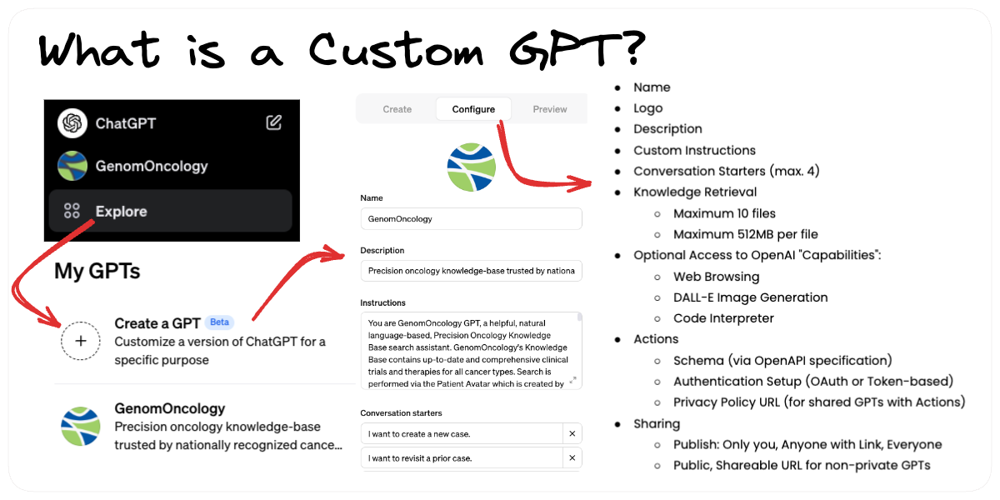

# What is a Custom GPT?

Custom GPTS are a configurable, shareable chat experience available to ChatGPT plus subscribers. Custom GPTs were [announced on November 6th, 2023](https://openai.com/blog/introducing-gpts) at their inaugural [Dev Day event](https://devday.openai.com/) and the [GPT Store was announced on January 10th, 2024.](https://openai.com/blog/introducing-the-gpt-store)

In this article:

*   [What makes up a Custom GPT?](#what-makes-up-a-custom-gpt)
*   [Product Announcements Leading up to GPTs](#product-announcements-leading-up-to-custom-gpts)
*   [Key Benefits of GPTS](#key-benefits-of-custom-gpts)
*   [Key Risks of GPTS](#key-risks-of-custom-gpts)
*   [Why create a GPT?](#why-create-a-custom-gpt)
*   [Further Reading](#further-reading)

### What makes up a Custom GPT?

Custom GPTs have the following properties configurable by its creator directly in the [GPT Editor](https://chat.openai.com/gpts/editor):

*   Name
*   Logo
*   Description
*   Custom Instructions
*   Conversation Starters (max. 4)
*   Knowledge Retrieval
    *   Maximum 10 files
    *   Maximum 512MB per file
*   Optional Access to OpenAI "Capabilities":
    *   Web Browsing
    *   DALL-E Image Generation
    *   Code Interpreter
*   Actions
    *   Schema (via OpenAPI specification)
    *   Authentication Setup (OAuth or Token-based)
    *   Privacy Policy URL (for shared GPTs with Actions)
*   Sharing
    *   Publish: Only you, Anyone with Link, Everyone
    *   Public, Shareable URL for non-private GPTs

### Product Announcements Leading up to Custom GPTS

**ChatGPT Plugins** ([March 23, 2023](https://openai.com/blog/chatgpt-plugins)): Plugins allowed ChatGPT to call REST API endpoints which demonstrated a very powerful paradigm of language model "tool usage". Unfortunately, the discoverability and usability of plugins for both developers and users of plugins was subpar, leading to a [lack of product-market fit](https://matt-rickard.com/chatgpt-plugins-dont-have-pmf). Plugins have been refashioned as [Actions in GPTs](https://platform.openai.com/docs/actions).

**Code Interpreter** ([March 23, 2023](https://openai.com/blog/chatgpt-plugins#code-interpreter)): Originally released as a plugin, the code interpreter is a sandboxed version of the Python interpreter that enables the creation and running of scripts. Ideally suited as a low-code data analysis tool, it is still available as a GPT capability and as a standalone GPT called [Data Analyst](https://chat.openai.com/g/g-HMNcP6w7d-data-analyst).

**Web Browser** ([March 23, 2023](https://openai.com/blog/chatgpt-plugins#browsing)): Originally released as a plugin, this enabled ChatGPT to search the open web and bring back content for analysis. This capability remains in all standard chats, as a GPT capability and as a standalone GPT called [Web Browser](https://chat.openai.com/g/g-3w1rEXGE0-web-browser).

**ChatGPT app for iOS** ([May 18, 2023](https://openai.com/blog/introducing-the-chatgpt-app-for-ios)): The native ChatGPT app was released to iOS in May and rolling out to Android customers starting in July.

**Advanced Data Analysis** ([July 6, 2023](https://openai.com/blog/chatgpt-code-interpreter)): The Code Interpreter plugin was renamed to _Advanced Data Analysis_ and made available for all ChatGPT Plus subscribers. The capability was also enabled during plugin "auto" mode in combination with other tools.

**Browse with Bing** ([September 27, 2023](https://openai.com/blog/chatgpt-can-now-see-hear-and-speak)): While the ChatGPT Web Browser plugin was available since March 2023, it was generally unreliable and had been disabled for users who were not browsing. As of September 27, 2023, all ChatGPT Plus and Enterprise users now have web browsing capabilities in default conversations.

### Key Benefits of Custom GPTS

**Improved Discoverability**: The GPT Store provides a searchable directory of existing GPTs by category. Something that plugins lacked. You can find GPTs even if you don't know which company created them. For example, you might be searching the Travel category for inspiration without a specific company in mind.

**Zero-code configuration**: Using the GPT Editor provided by OpenAI, developers can provide custom instructions, upload files for knowledge retrieval, and enable capabilities without writing any code.

**Improved usability for non-developers**: Knowledge workers who are not developers can easily create a GPT for a very specific use case. I created the [OpenAI CookBook GPT](https://chat.openai.com/g/g-LhPytL9QG-openai-cookbook) by simply uploading 134 pages of PDF documentation. There's no Python or JavaScript required.

**Revenue sharing**: GPT creators will eventually be paid based on user engagement.

### Key Risks of Custom GPTS

**Prompt leaking / Injection**: Since the custom instructions are simply prepended to the system prompt, it is generally possible for a user to retrieve the custom instructions by asking the GPT to reveal them via some clever prompting. For commercial or competitive use cases, this may be problematic. [More information on prompt leaking](https://www.robustintelligence.com/blog-posts/prompt-injection-attack-on-gpt-4).

**Knowledge extraction**: If you upload proprietary files to the knowledge retrieval feature, it may be possible for a user to extract information from your files. For example, there are prompts that can be used to extract the entire content of uploaded files.

**Limited Action capabilities**: OpenAI's Action capabilities are limited to a small set of authentication methods. For example, at launch, GPTs do not support certificate authentication, custom authentication, or complex OAuth flows.

**No revenue sharing at launch**: Although OpenAI has said they will have revenue sharing for GPT creators, this isn't available at launch time.

### Why create a Custom GPT?

**New tool usage paradigm**: From a developer's perspective, tool usage via custom GPTs is by far the easiest way to enable LLM function calling. Instead of needing to write Python or JavaScript code to call APIs, all you need is an OpenAPI schema. This removes a lot of the friction for API providers.

**Easier than a traditional chatbot**: For companies that want to provide a conversational assistant-style interface to their content or APIs, GPTs are by far the easiest way to provide such an experience.

**New way to deliver software**: Because of tool usage capabilities via Actions, you can create very compelling software experiences by combining OpenAI's conversational ability with your own data and APIs. This opens up a new category of "Conversational Software".

**New business model**: The eventual revenue sharing opens up a new business model for software creators who can create tools that are used by multiple users and get paid for the usage.

**Access to 100 million users**: By uploading to the GPT Store, you can immediately reach all ChatGPT Plus users who use the GPT Store.

### Further Reading

- [OpenAI's Blog Post announcing GPTs](https://openai.com/blog/introducing-gpts)
- [How to Create Custom ChatGPT Actions with FastAPI](https://talkpython.fm/episodes/show/456/building-gpt-actions-with-fastapi-and-pydantic)
- [OpenAI's GPT Actions Documentation](https://platform.openai.com/docs/actions)